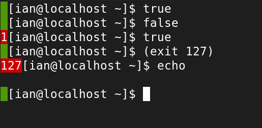

# Status Check

Modify your command prompt with a discrete indicator for the previous command's return code - `$?`.



## Installation

```bash
git clone https://github.com/ian-llewellyn/sts-check.git
echo ". $PWD/sts-check/sts-check" >> $HOME/.bashrc
```
